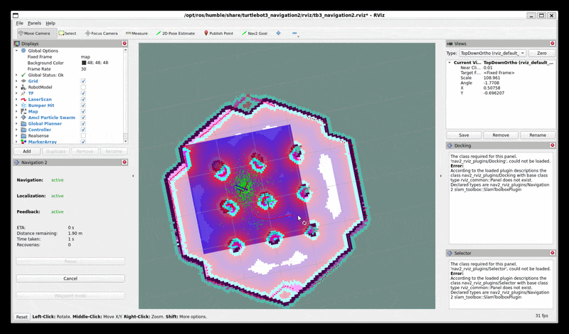

# Warehouse AGV ROS2

Autonomous Ground Vehicle simulation using ROS2, LiDAR SLAM, and Nav2 — with a C# RCS (Robot Control System) API and WebSocket control client.

## Tech Stack

- ROS2 Humble
- Cartographer SLAM / SLAM Toolbox
- Nav2 (Navigation2)
- Gazebo
- C# (.NET 8) ASP.NET Core Web API
- C# WebSocket client via rosbridge
- C++ / Python ROS2 nodes

## Architecture
[Gazebo Simulation]

|

[LiDAR /scan]

|

[Cartographer SLAM] → [/map]

|

[Nav2 Stack] ← [/move_base_simple/goal]

|

[rosbridge WebSocket :9090]

|

[RCS API (ASP.NET Core)]

POST /api/missions       ← mission 등록 및 즉시 실행

GET  /api/missions       ← 전체 mission 목록 조회

GET  /api/missions/{id}  ← 단일 mission 조회

PATCH /api/missions/{id}/status ← 상태 업데이트

GET  /api/status         ← AGV 실시간 위치/상태
## Features

- 2D LiDAR 기반 창고 환경 매핑 (Cartographer SLAM)
- Nav2 자율 경로 계획 및 장애물 회피
- **동적 장애물 회피** — Gazebo Actor 기반 이동 장애물, Nav2 실시간 재경로 계획
- **RCS API** — C# ASP.NET Core 기반 임무 큐 관리 시스템
  - Mission 등록/조회/상태 업데이트 REST API
  - rosbridge WebSocket 연동으로 Nav2에 직접 goal 전송
  - Rosbridge 미연결 시 graceful 처리 (자동 재연결)
- C# WebSocket 클라이언트 — /odom 구독으로 실시간 위치 수신
- C++ velocity publisher, Python waypoint follower 노드

## Run

**1. Launch simulation (dynamic obstacle world)**
```bash
export FASTDDS_DISABLE_SHM=1
export TURTLEBOT3_MODEL=burger
ros2 launch turtlebot3_gazebo turtlebot3_world.launch.py \
  world:=$HOME/warehouse-agv-ros2/worlds/turtlebot3_world_dynamic.world
```

**2. Launch Nav2**
```bash
export FASTDDS_DISABLE_SHM=1
export TURTLEBOT3_MODEL=burger
ros2 launch turtlebot3_navigation2 navigation2.launch.py use_sim_time:=True
```

**3. Launch rosbridge**
```bash
ros2 launch rosbridge_server rosbridge_websocket_launch.xml
```

**4. Run RCS API**
```bash
cd ~/warehouse-agv-ros2/rcs_api && dotnet run
# Swagger UI: http://localhost:5000/swagger
```

**5. Send mission via API**
```bash
curl -X POST http://localhost:5000/api/missions \
  -H "Content-Type: application/json" \
  -d '{"targetLocation": "1.5,0.5"}'
```

## Demo

### 동적 장애물 회피 (Dynamic Obstacle Avoidance)
Nav2가 실시간으로 장애물을 감지하고 경로를 재계획하는 시뮬레이션입니다.


